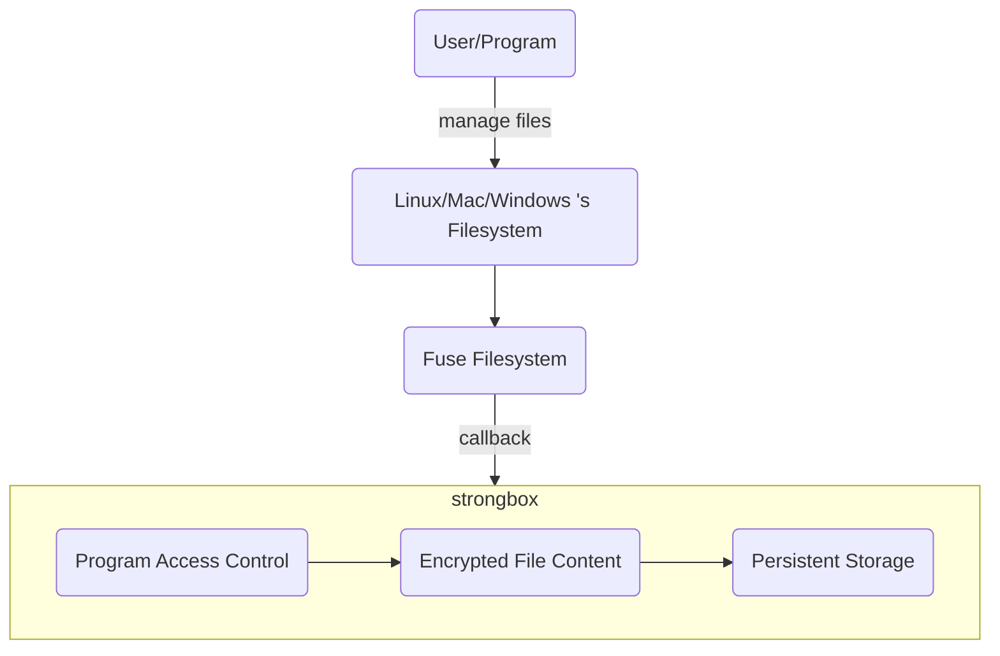

# strongbox

## Introduction

strongbox is used to keep files safe, When the system reads and writes files, strongbox captures the event through the fuse callback, judges the permission of the read and write process, and encrypts and decrypts the read and write persistent storage to ensure file security.

## Capability

* Manage read and write directory/file permissions through process whitelist
* Encrypt local persistent files

## Architecture



## Usage

Start by command

```shell
Usage of ./strongbox:
  -config string
        config file. (default "config.yml")

Exmaple:
    strongbox -config ./config.yml
```

config file description

```yaml
# target file path
mountPoint: /tmp/w1
# encrypted persistent storage path
secretPath: /tmp/w2/i.db
# process whitelist, full binary path
allowProcess:
  - "/usr/local/Cellar/git/2.29.2/bin/git"
  - "/Applications/Visual Studio Code.app/Contents/MacOS/Electron"
# watchMode=true only prints interception information, does not perform interception operations
watchMode: false
```

To start the process, you need to enter a password.

After completion, only the whitelist process can operate the files and directories in `/tmp/w1`, and other processes have no permission to access. And the files in this directory are encrypted then saved to `/tmp/w2`, so there is no need to worry about the risk of leakage.
